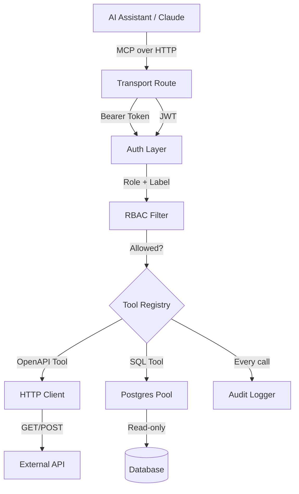
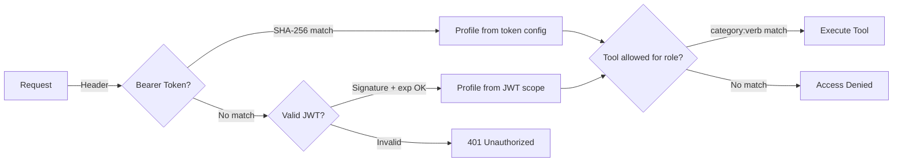
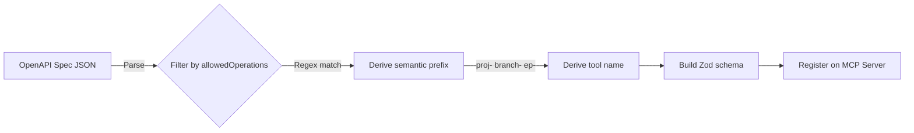

# MCP Server Framework

A reusable framework for exposing APIs and databases to AI assistants via the [Model Context Protocol](https://modelcontextprotocol.io/). Ships with a Neon implementation, but the architecture is designed to fork-- swap in any OpenAPI spec and you have a new MCP server with auth, RBAC, audit logging, and SQL tools out of the box.

> **New fork? Open [KICKSTART.md](KICKSTART.md).** Paste the prompt into Claude Code and it'll walk you end-to-end from empty fork to deployed MCP connected to Claude.ai-- asking one question at a time, without touching production without your say-so.

## Architecture

Every request flows through authentication, RBAC filtering, and audit logging before reaching the tool layer. Tools are either auto-generated from an OpenAPI spec or hand-registered (like the SQL tools).



## Security Model

Three-layer auth: bearer token lookup, JWT fallback, then RBAC enforcement. A request that fails any layer never reaches the tools.



**Key details:**

- Tokens are never stored in plain text-- compared via SHA-256 hashes with `timingSafeEqual`
- JWT verification checks both signature and expiration
- RBAC filters tools before the client sees them-- disallowed tools are invisible, not just hidden

## RBAC System

RBAC uses a **category:verb** model. Every tool prefix is auto-classified into one of 6 resource categories, then checked against the role's permissions.

### Resource Categories

| Category | Auto-classified by keywords | Examples |
|----------|---------------------------|----------|
| `work` | task, ticket, issue, project, pipeline | `proj-listProjects`, `branch-createBranch` |
| `people` | contact, company, account, user, org | `org-listOrganizations` |
| `financial` | invoice, payment, billing, subscription | `consumption-getHistory` |
| `content` | document, file, email, template, page | File/doc tools |
| `config` | setting, webhook, api_key, role, schema | `apikey-listApiKeys`, `role-listRoles` |
| `reporting` | report, analytics, log, usage, consumption | `describe_schema`, `run_sql` |

### Default Roles

| Role | Permissions |
|------|------------|
| `admin` | `*:*` -- full access to everything |
| `lead` | `work:*`, `people:*`, `content:*`, `reporting:read` |
| `member` | `work:*`, `people:read`, `content:read` |
| `finance` | `financial:*`, `people:read`, `reporting:read` |
| `external` | `work:read`, `content:read` |
| `viewer` | `*:read` -- read-only across all categories |

### Auto-Classification

Prefixes are classified by keyword matching against `CATEGORY_HINTS` in `src/security/categories.ts`. If a prefix contains "project" it maps to `work`. If it contains "invoice" it maps to `financial`. Unmatched prefixes fall to `uncategorized`.

### Data Classification Tiers

| Tier | Label | Default Access | Examples |
|------|-------|---------------|----------|
| 1 | Open | All authenticated | Product catalog, KB articles |
| 2 | Internal | All company roles | Tickets, projects, company records |
| 3 | Confidential | Named roles only | Invoices, contracts, PII |
| 4 | Restricted | Admin only | API keys, credentials |

## Tool Generation Pipeline

Tools are auto-generated from the bundled OpenAPI spec. Each endpoint is filtered by the allowed operations list, assigned a semantic prefix, and registered on the MCP server.



The `PREFIX_MAP` in `src/tools/registry.ts` maps URL path segments to prefixes:

| Path Segment | Prefix |
|-------------|--------|
| `projects` | `proj-` |
| `branches` | `branch-` |
| `endpoints` | `ep-` |
| `databases` | `db-` |
| `roles` | `role-` |
| `operations` | `op-` |
| `consumption_history` | `consumption-` |
| `regions` | `region-` |
| `api_keys` | `apikey-` |
| `organizations` | `org-` |

Tool count is capped at 128 (MCP protocol limit). A warning fires at 80+.

## Database Tools

Three built-in tools. The warehouse guide is Claude's cheat sheet, the other two give direct schema + SQL access with read-only enforcement (`SET default_transaction_read_only = ON`):

- **`get_warehouse_guide`** -- Returns the contents of [`src/warehouse-guide.ts`](src/warehouse-guide.ts). Claude calls this FIRST so it writes correct SQL on the first try, without burning tokens on `describe_schema` + trial-and-error. You customize this file with your tables, business-term definitions (what "active customer" means here), pre-computed columns to use verbatim, and anti-patterns to avoid. This is the **single most important customization** -- see [Customize your warehouse guide](#customize-your-warehouse-guide) below.
- **`describe_schema`** -- Lists tables and columns from `information_schema`. Filter by schema or table name.
- **`run_sql`** -- Executes read-only SQL (SELECT/WITH/EXPLAIN/SHOW only). Forbidden keywords are blocked, LIMIT is auto-added, responses truncated at 50KB.

## Customize your warehouse guide

Open [`src/warehouse-guide.ts`](src/warehouse-guide.ts). The file is heavily commented with a methodology for building a guide from real user stories ("As a [role], I want to know [question] so I can [action]"). The format:

1. **Collect user stories** from the people who'll actually use this MCP
2. **Identify business terms** in each story -- "active", "overdue", "at risk", "profitable" -- these all need precise definitions
3. **Get the exact definition from the stakeholder** -- don't guess
4. **Write the SQL and verify the output** -- show the result to the stakeholder and ask "does this look right?" The verification step is not optional
5. **Lock it in** -- put the definition AND the exact SQL in the guide, with a "NEVER re-derive" rule for anti-patterns

The guide grows organically. Start with your 3-5 most-queried tables and 5-10 user stories. Add more as your team asks new questions. A good warehouse guide keeps Claude from guessing and gives it the same shared vocabulary your humans use.

For the specific workflow of locking in business-term definitions (e.g. "reactive ticket", "MRR", "at-risk account") as deterministic SQL, see [docs/building-deterministic-queries.md](docs/building-deterministic-queries.md). That doc has copy-paste prompts you use inside Claude.ai to verify each definition against real data before committing it to the warehouse guide.

## Two Ways to Use This Repo

**1. Deploy the Neon MCP as-is (most people, week 1).** Fork, rename, deploy, plug it into Claude. You get a working MCP your whole team can use, read-only, with Google or Microsoft SSO gating access. Follow the Quick Start below.

**2. Fork for a different API.** Swap the OpenAPI spec, update the prefix map, redeploy-- and you have an MCP for ConnectWise, HubSpot, Stripe, or any OpenAPI-described service. See [docs/FRAMEWORK.md](docs/FRAMEWORK.md) and [AI_README.md](AI_README.md) (for Claude/Copilot/Cursor to do the fork work).

## Quick Start

Your team signs in from Claude.ai desktop, web, or mobile. Bearer tokens are a fallback for local Claude Code dev.

1. **Fork this repo** and rename it to whatever fits your team (`acme-mcp`, `sparkle-mcp`, etc.)
2. **Deploy to Vercel** -- the Next.js framework preset is auto-detected
3. **Set required env vars** in Vercel >> Project Settings >> Environment Variables:
   - `NEON_API_KEY` -- your Neon API key
   - `MCP_AUTH_TOKENS` -- JSON with token, role, and label (used by Claude Code + as a break-glass)
   - `OAUTH_CLIENT_ID`, `OAUTH_CLIENT_SECRET`, `OAUTH_JWT_SECRET`, `PUBLIC_URL` -- enables Claude.ai connector flow
   - `DATABASE_URL` -- Neon connection string (used for OAuth session storage and, if you enable Custom Auth, for user records)
4. **Pick a sign-in method** -- set up at least one. Mix and match; the MCP shows a picker when multiple are configured:
   - **[Google SSO](docs/google-sso-setup.md)** -- Google Workspace or personal Gmail. Access via email allowlist.
   - **[Microsoft SSO](docs/microsoft-sso-setup.md)** -- Microsoft 365 / Entra. Access via security group membership.
   - **[Custom Auth](docs/custom-auth-setup.md)** -- **already built in, no external IdP needed**. Password + TOTP 2FA, admin UI at `/api/admin`, encrypted secrets, backup codes, account lockout-- all baked in. Generate two secrets, set env vars, deploy, start inviting users. Fastest path from fork to working; also the right call when you need access for people outside your IdP (contractors, clients, partners).
5. **Add the connector in Claude.ai** -- Settings >> Connectors >> Add custom connector, paste `https://your-app.vercel.app/api/mcp`. In Advanced settings, paste your `OAUTH_CLIENT_ID` and `OAUTH_CLIENT_SECRET` values. Your team signs in via whichever method you configured.
6. **Verify** by asking Claude to list your Neon projects.

### MCP_AUTH_TOKENS format

```json
{
  "tokens": [
    {
      "token": "your-secure-token-here",
      "profile": "admin",
      "label": "Your Name"
    }
  ]
}
```

Generate a token: `openssl rand -base64 32`

## Configuration Reference

### Required

| Variable | Type | Description |
|----------|------|-------------|
| `NEON_API_KEY` | `string` | Neon API key from console.neon.tech >> Account >> API Keys |
| `MCP_AUTH_TOKENS` | `JSON` | Bearer tokens with role and label assignments |

### Security & RBAC

| Variable | Type | Default | Description |
|----------|------|---------|-------------|
| `RBAC_PROFILES` | `JSON` | Built-in 6 roles | Custom role definitions with category:verb permissions |
| `ALLOWED_OPERATIONS` | `JSON` | Read-only GET endpoints | Which API operations are callable (method + path regex) |

### Performance

| Variable | Type | Default | Description |
|----------|------|---------|-------------|
| `REQUEST_TIMEOUT_MS` | `number` | `30000` | Upstream API request timeout in ms |
| `MAX_RESPONSE_BYTES` | `number` | `1048576` | Max response body size (1MB) |

### OAuth (required for Claude.ai desktop / web / mobile)

These power the Claude.ai custom connector flow. Set all four whenever you want anyone outside Claude Code to use the MCP-- which is the intended deployment.

| Variable | Type | Description |
|----------|------|-------------|
| `OAUTH_CLIENT_ID` | `string` | Self-chosen identifier |
| `OAUTH_CLIENT_SECRET` | `string` | Self-generated secret |
| `OAUTH_JWT_SECRET` | `string` | JWT signing key (defaults to `NEON_API_KEY`) |
| `PUBLIC_URL` | `string` | Your deployed URL, no trailing slash |

### Database (for OAuth session storage)

| Variable | Type | Description |
|----------|------|-------------|
| `DATABASE_URL` | `string` | Neon connection string for OAuth persistence |

### Sign-in methods (pick any combination-- this is how your team signs in)

Multiple configured? Users see a picker. Only one? The MCP auto-redirects or renders its form.

**Microsoft SSO** -- Entra security groups map to roles. [Full walkthrough](docs/microsoft-sso-setup.md)

| Variable | Type | Description |
|----------|------|-------------|
| `MICROSOFT_TENANT_ID` | `string` | Azure AD tenant ID |
| `MICROSOFT_CLIENT_ID` | `string` | Entra app registration client ID |
| `MICROSOFT_CLIENT_SECRET` | `string` | Entra app client secret |
| `MICROSOFT_GROUP_PROFILES` | `JSON` | Maps security group GUIDs to roles |

**Google SSO** -- email allowlist maps to roles. [Full walkthrough](docs/google-sso-setup.md)

| Variable | Type | Description |
|----------|------|-------------|
| `GOOGLE_CLIENT_ID` | `string` | Google OAuth client ID |
| `GOOGLE_CLIENT_SECRET` | `string` | Google OAuth client secret |
| `GOOGLE_EMAIL_PROFILES` | `JSON` | Maps email addresses to roles |

**Custom Auth** -- team-managed users, password + TOTP 2FA. Admin UI at `/api/admin`. [Full walkthrough](docs/custom-auth-setup.md)

| Variable | Type | Description |
|----------|------|-------------|
| `CUSTOM_AUTH_ENCRYPTION_KEY` | `string` | 64-char hex key for AES-256-GCM encryption of TOTP secrets at rest |
| `CUSTOM_AUTH_ADMIN_TOKEN` | `string` | Bearer-style shared secret that gates `/api/admin` (min 16 chars) |
| `CUSTOM_AUTH_ISSUER` | `string` | Optional-- name shown in authenticator apps (default: `Claude MCP`) |

## Testing

Tests live in `tests/` and cover auth, RBAC, tool generation, database tools, and HTTP client behavior.

```bash
npm test                 # run all tests
npm test -- --watch     # watch mode
```

The test harness in `tests/setup.ts` provides mock configs and utilities. To test with your own OpenAPI spec, replace `spec/neon-v2.json` and run the tool generation tests to verify your tools register correctly.

## Project Structure

```
app/
  api/
    [transport]/route.ts        # MCP handler entry point
    oauth/
      authorize/route.ts        # Passphrase auth, code generation
      token/route.ts            # Token exchange + refresh
  .well-known/
    oauth-authorization-server/ # OAuth discovery metadata
src/
  config.ts                     # Env var loading + defaults
  security/
    auth.ts                     # Token >> profile mapping
    rbac.ts                     # Category:verb RBAC engine
    categories.ts               # Auto-classification by keyword hints
    audit.ts                    # Structured JSON audit logging
  tools/
    registry.ts                 # OpenAPI >> tool definitions
    database.ts                 # describe_schema, run_sql
  http/
    client.ts                   # API client + retry logic
    redactor.ts                 # Sensitive field redaction
    truncate.ts                 # Response size limiting
  types/
    index.ts                    # Shared TypeScript interfaces
spec/
  neon-v2.json                  # Bundled OpenAPI spec (swap this)
docs/
  FRAMEWORK.md                        # How to fork for a new API
  SETUP.md                            # Deployment guide
  cloudflare-proxy-setup.md           # Putting CF orange-cloud in front of Vercel
  google-sso-setup.md                 # Google SSO configuration
  microsoft-sso-setup.md              # Microsoft SSO configuration
  custom-auth-setup.md                # Team-managed users with password + TOTP 2FA
  building-deterministic-queries.md   # Copy-paste Claude.ai prompts for locking in business-term SQL
```

## Forking for a New API

This is a framework, not just a Neon server. See [docs/FRAMEWORK.md](docs/FRAMEWORK.md) for a step-by-step guide to forking this for any OpenAPI-described service-- ConnectWise, HubSpot, Stripe, whatever.
