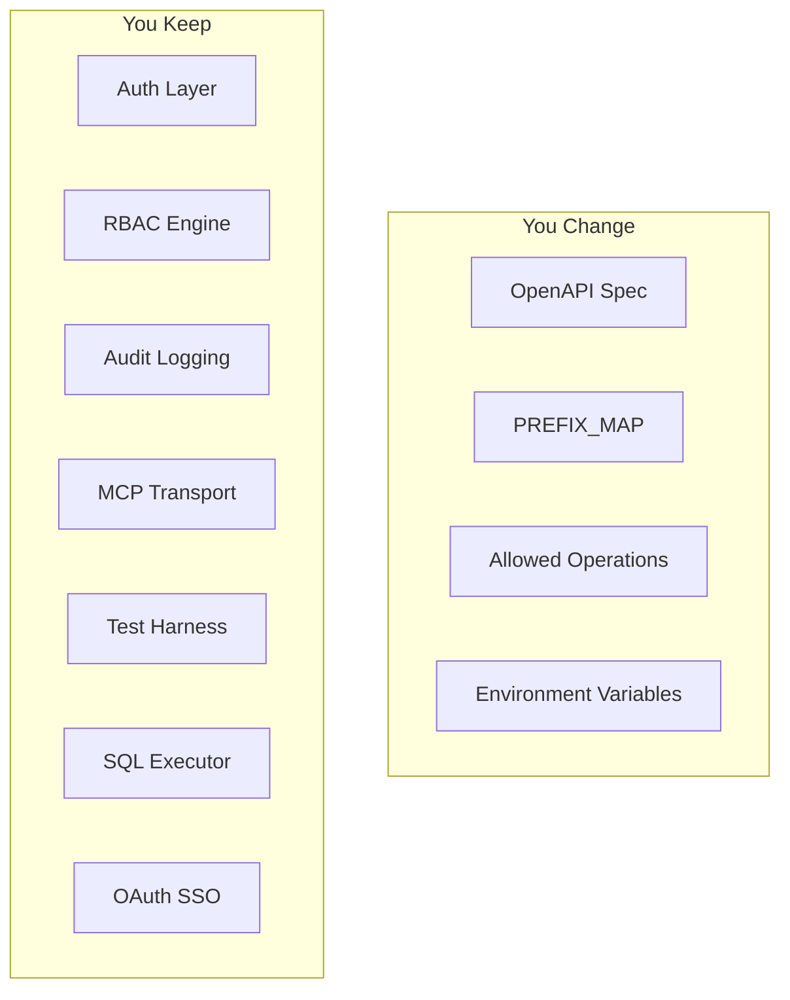

# Framework Guide: Fork This for Any API

This repo is designed to be forked. The security layer, RBAC engine, audit logging, OAuth flow, and MCP transport are generic-- you only change the parts that describe your API.

## What You Change vs What You Keep



The "You Keep" layer is ~90% of the codebase. The "You Change" layer is config and one JSON file.

## Step-by-Step Fork Guide

### 1. Fork the Repo

```bash
gh repo fork your-org/mcp-neon --clone
cd mcp-neon
npm install
```

### 2. Replace the OpenAPI Spec

Drop your service's OpenAPI spec (v3.x JSON) into `spec/`:

```bash
# Remove the Neon spec
rm spec/neon-v2.json

# Add yours
cp ~/downloads/your-api-v1.json spec/your-api-v1.json
```

Update the import in the transport route (`app/api/[transport]/route.ts`) to point to your new spec file.

### 3. Update PREFIX_MAP

Open `src/tools/registry.ts` and replace the `PREFIX_MAP` with prefixes that match your API's URL structure:

```typescript
// Before (Neon)
const PREFIX_MAP: Record<string, string> = {
  projects: "proj-",
  branches: "branch-",
  endpoints: "ep-",
  // ...
};

// After (your API -- e.g., ConnectWise)
const PREFIX_MAP: Record<string, string> = {
  tickets: "ticket-",
  companies: "company-",
  contacts: "contact-",
  projects: "proj-",
  invoices: "invoice-",
  configurations: "config-",
  // ...
};
```

The keys are URL path segments from your OpenAPI spec. The values are the prefixes that get prepended to tool names.

### 4. Review Auto-Classification

Your new prefixes will be auto-classified by keyword matching in `src/security/categories.ts`. Check that the classification makes sense for your API:

| Your Prefix | Contains Keyword | Auto-classified As |
|------------|-----------------|-------------------|
| `ticket-` | "ticket" | `work` |
| `company-` | "company" | `people` |
| `invoice-` | "invoice" | `financial` |
| `config-` | "config" | `config` |

If a prefix doesn't match any keyword hints, it falls to `uncategorized`. You can either:
- Add keywords to `CATEGORY_HINTS` in `src/security/categories.ts`
- Override classification in your RBAC config via the `RBAC_PROFILES` env var

### 5. Update Allowed Operations

Open `src/config.ts` and update `DEFAULT_ALLOWED_OPERATIONS` to match the endpoints you want to expose:

```typescript
// Before (Neon -- read-only GET endpoints)
const DEFAULT_ALLOWED_OPERATIONS: OperationPattern[] = [
  { method: "get", pathPattern: "^/projects$" },
  { method: "get", pathPattern: "^/projects/[^/]+$" },
  // ...
];

// After (your API)
const DEFAULT_ALLOWED_OPERATIONS: OperationPattern[] = [
  { method: "get", pathPattern: "^/service/tickets$" },
  { method: "get", pathPattern: "^/service/tickets/[^/]+$" },
  { method: "get", pathPattern: "^/company/companies$" },
  { method: "get", pathPattern: "^/company/companies/[^/]+$" },
  // ...
];
```

Start with read-only GET operations. Add write operations only after you've verified the RBAC roles are set up correctly.

### 6. Update the HTTP Client

The HTTP client in `src/http/client.ts` points to the Neon API base URL. Update it for your service:

```typescript
// Before
const BASE_URL = "https://console.neon.tech/api/v2";

// After
const BASE_URL = "https://api.yourservice.com/v1";
```

Also update the auth header if your API uses a different authentication scheme (API key header name, OAuth bearer, etc.).

### 7. Set Environment Variables

Rename the API key variable and update `.env.example`:

| Old | New |
|-----|-----|
| `NEON_API_KEY` | `YOUR_SERVICE_API_KEY` |

Update `src/config.ts` to read the new variable name.

### 8. Deploy to Vercel

```bash
vercel deploy
```

Set your env vars in Vercel >> Project Settings >> Environment Variables.

### 9. Test

Run the existing test suite to verify your spec parses and tools generate correctly:

```bash
npm test
```

The test harness will catch:
- Spec parsing errors
- Tool count exceeding the 128-tool MCP limit
- RBAC filter issues
- Auth configuration problems

## RBAC Setup Guide

### Default Roles Work Out of the Box

The 6 default roles (`admin`, `lead`, `member`, `finance`, `external`, `viewer`) are generic enough for most B2B APIs. Auto-classification handles the mapping from your prefixes to categories.

### Custom Roles via Env Var

Override roles using the `RBAC_PROFILES` environment variable:

```json
{
  "admin": {
    "permissions": [{ "category": "*", "verb": "*" }]
  },
  "support": {
    "permissions": [
      { "category": "work", "verb": "*" },
      { "category": "people", "verb": "read" }
    ]
  },
  "billing-team": {
    "permissions": [
      { "category": "financial", "verb": "*" },
      { "category": "reporting", "verb": "read" }
    ]
  }
}
```

### Role Inheritance

Roles support an `inherits` property to chain permissions:

```json
{
  "viewer": {
    "permissions": [{ "category": "*", "verb": "read" }]
  },
  "editor": {
    "inherits": "viewer",
    "permissions": [
      { "category": "work", "verb": "*" },
      { "category": "content", "verb": "*" }
    ]
  }
}
```

The `editor` role gets its own permissions plus everything from `viewer`.

### Verb Mapping

HTTP methods map to RBAC verbs automatically:

| HTTP Method | RBAC Verb |
|------------|-----------|
| `GET` | `read` |
| `POST` | `create` |
| `PUT`, `PATCH` | `update` |
| `DELETE` | `delete` |

## Testing Your Fork

The test harness in `tests/` is framework-level-- it tests auth, RBAC, and tool generation without being Neon-specific. After swapping your spec:

1. **Tool generation test** -- Verifies your spec parses and tools register under the 128 limit
2. **RBAC filter test** -- Verifies roles see only allowed tools based on category:verb
3. **Auth test** -- Verifies token lookup and JWT fallback
4. **Database test** -- If you use the SQL tools, verifies read-only enforcement

```bash
# Run all tests
npm test

# Run just tool generation
npm test -- --grep "registry"

# Run RBAC tests
npm test -- --grep "rbac"
```

## Examples

### ConnectWise Manage Fork

```typescript
// PREFIX_MAP
const PREFIX_MAP = {
  tickets: "ticket-",
  companies: "company-",
  contacts: "contact-",
  projects: "proj-",
  invoices: "invoice-",
  configurations: "config-",
  members: "member-",
  boards: "board-",
  statuses: "status-",
};

// DEFAULT_ALLOWED_OPERATIONS (start read-only)
const DEFAULT_ALLOWED_OPERATIONS = [
  { method: "get", pathPattern: "^/service/tickets$" },
  { method: "get", pathPattern: "^/service/tickets/[^/]+$" },
  { method: "get", pathPattern: "^/company/companies$" },
  { method: "get", pathPattern: "^/company/companies/[^/]+$" },
  { method: "get", pathPattern: "^/project/projects$" },
  { method: "get", pathPattern: "^/finance/invoices$" },
];
```

Auto-classification would map: `ticket-` >> `work`, `company-` >> `people`, `invoice-` >> `financial`, `config-` >> `config`.

### HubSpot Fork

```typescript
// PREFIX_MAP
const PREFIX_MAP = {
  contacts: "contact-",
  companies: "company-",
  deals: "deal-",
  tickets: "ticket-",
  engagements: "engagement-",
  pipelines: "pipeline-",
  owners: "owner-",
};

// DEFAULT_ALLOWED_OPERATIONS
const DEFAULT_ALLOWED_OPERATIONS = [
  { method: "get", pathPattern: "^/crm/v3/objects/contacts$" },
  { method: "get", pathPattern: "^/crm/v3/objects/contacts/[^/]+$" },
  { method: "get", pathPattern: "^/crm/v3/objects/companies$" },
  { method: "get", pathPattern: "^/crm/v3/objects/deals$" },
  { method: "get", pathPattern: "^/crm/v3/pipelines/[^/]+$" },
];
```

Auto-classification: `contact-` >> `people`, `deal-` >> `work`, `ticket-` >> `work`, `pipeline-` >> `work`.

### Stripe Fork

```typescript
// PREFIX_MAP
const PREFIX_MAP = {
  customers: "customer-",
  charges: "charge-",
  invoices: "invoice-",
  subscriptions: "sub-",
  products: "product-",
  prices: "price-",
  payment_intents: "payment-",
  balance: "balance-",
};

// DEFAULT_ALLOWED_OPERATIONS
const DEFAULT_ALLOWED_OPERATIONS = [
  { method: "get", pathPattern: "^/v1/customers$" },
  { method: "get", pathPattern: "^/v1/customers/[^/]+$" },
  { method: "get", pathPattern: "^/v1/invoices$" },
  { method: "get", pathPattern: "^/v1/subscriptions$" },
  { method: "get", pathPattern: "^/v1/balance$" },
];
```

Auto-classification: `customer-` >> `people`, `invoice-` >> `financial`, `payment-` >> `financial`, `sub-` >> `financial` (matches "subscription" hint).
