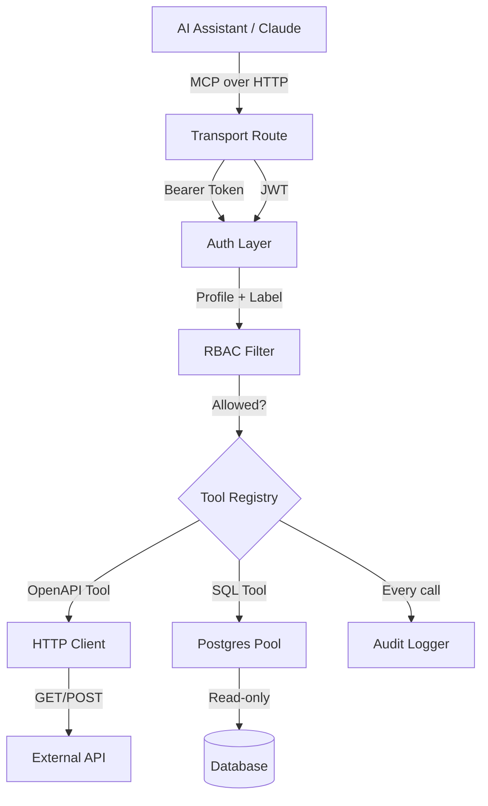
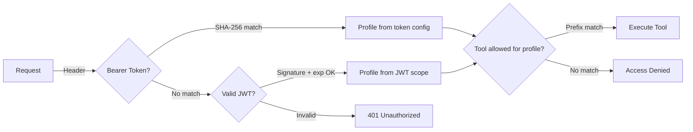
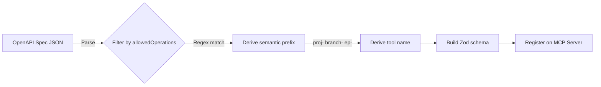
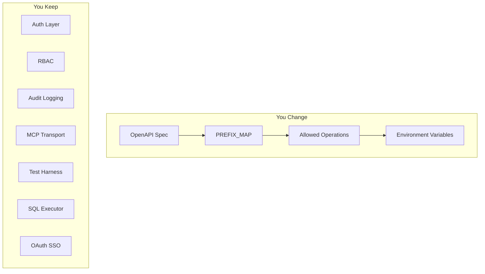

# MCP Framework Cleanup -- Implementation Plan

> **For Claude:** REQUIRED SUB-SKILL: Use superpowers:executing-plans to implement this plan task-by-task.

**Goal:** Transform mcp-neon from a half-wired proof-of-concept into a clean, ultra-reusable MCP framework that serves as the gold standard for all future MCP servers.

**Architecture:** Strip dead weight (blackout windows, IP restriction, dry-run/confirm gates, unused deps). Wire up the orphaned OpenAPI tool pipeline and RBAC. Extract duplicated code into shared modules. Thread auth context through the entire request path. Add Laravel-style test helpers. Document everything with Mermaid diagrams so an AI can fork this and wire it into a new data source in an afternoon.

**Tech Stack:** Next.js App Router, MCP SDK, Zod, pg, Vitest

**What stays:** Bearer token auth, OAuth SSO (Google + Microsoft), OpenAPI-to-tool generation, SQL executor, audit logging, RBAC (simplified)

**What gets cut:** Blackout windows, IP restriction, dry-run/confirm write gates, AJV (unused), Pino (unused), `defaultLimit`/`maxLimit`/`logLevel` (dead config)

---

## Task 1: Remove Dead Dependencies and Dead Config

**Files:**
- Modify: `package.json`
- Modify: `src/config.ts`
- Modify: `src/types/index.ts`
- Delete: `src/security/write-gates.ts`
- Delete: `tests/security/write-gates.test.ts`

**Step 1: Remove unused npm packages**

```bash
npm uninstall ajv ajv-formats pino
```

These are imported in package.json but never used in any source file.

**Step 2: Remove write-gates module**

Delete `src/security/write-gates.ts` and `tests/security/write-gates.test.ts`. User confirmed: no blackout windows, no dry-run, no confirm gates needed.

**Step 3: Remove dead config fields from `src/config.ts`**

Remove from `AppConfig` and `loadConfig()`:
- `blackoutWindows` (no longer needed)
- `enableDryRun` (no longer needed)
- `requireConfirmWrites` (no longer needed)
- `writeAllowlist` (no longer needed -- write permissions handled by `allowedOperations`)
- `defaultLimit` (read from env but never consumed anywhere)
- `maxLimit` (read from env but never consumed anywhere)
- `logLevel` (read from env, pino never imported)

Also remove:
- `DEFAULT_WRITE_ALLOWLIST` constant
- All env reads for `WRITE_ALLOWLIST`, `BLACKOUT_WINDOWS`, `REQUIRE_CONFIRM_WRITES`, `ENABLE_DRY_RUN`, `DEFAULT_LIMIT`, `MAX_LIMIT`, `LOG_LEVEL`

**Step 4: Remove dead type fields from `src/types/index.ts`**

Remove from `AppConfig`:
- `blackoutWindows`, `writeAllowlist`, `requireConfirmWrites`, `enableDryRun`, `defaultLimit`, `maxLimit`, `logLevel`

Remove from `AuditEntry`:
- `sourceIP` (never populated)
- `dryRun` (write gates removed)
- `confirmed` (write gates removed)

Remove `BlackoutWindow` type entirely.

**Step 5: Update config tests**

Modify `tests/config.test.ts`:
- Remove tests for `defaultLimit`, `maxLimit`, `logLevel`, `blackoutWindows`, `enableDryRun`, `requireConfirmWrites`
- Remove tests for `REQUIRE_CONFIRM_WRITES` and `ENABLE_DRY_RUN` overrides

**Step 6: Run tests**

```bash
npm test
```

Expected: All remaining tests pass. Write-gate tests gone. Config tests reduced.

**Step 7: Commit**

```bash
git add -A
git commit -m "Remove dead code: write-gates, unused deps (ajv/pino), dead config fields

- Delete write-gates module (blackout windows, dry-run, confirm gates)
- Uninstall ajv, ajv-formats, pino (imported but never used)
- Remove dead config: defaultLimit, maxLimit, logLevel, writeAllowlist,
  blackoutWindows, enableDryRun, requireConfirmWrites
- Remove dead types: BlackoutWindow, sourceIP, dryRun, confirmed
- Update config tests to match"
```

---

## Task 2: Fix Environment Variable Naming

Every optional var in `.env.example` has a `NEON_` prefix that `config.ts` doesn't read. Users who follow the example file get silent misconfiguration.

**Files:**
- Modify: `src/config.ts`
- Modify: `.env.example`
- Modify: `tests/config.test.ts`

**Step 1: Standardize on unprefixed names in `.env.example`**

The code reads `RBAC_PROFILES`, `ALLOWED_OPERATIONS`, etc. Fix `.env.example` to match. Remove the `NEON_` prefix from all optional vars in the example file.

After Task 1, the remaining optional vars are:
- `RBAC_PROFILES`
- `ALLOWED_OPERATIONS`
- `REQUEST_TIMEOUT_MS`
- `MAX_RESPONSE_BYTES`
- `DATABASE_URL`
- OAuth vars (already correct)

Update `.env.example` comments to match actual var names.

**Step 2: Run tests**

```bash
npm test
```

**Step 3: Commit**

```bash
git commit -am "Fix .env.example: var names now match what config.ts actually reads"
```

---

## Task 3: Extract Shared Utilities

Three patterns are duplicated across files. Extract each into a shared module.

**Files:**
- Create: `src/security/jwt.ts`
- Create: `src/http/html.ts`
- Create: `src/http/truncate.ts`
- Modify: `src/security/providers/google.ts`
- Modify: `src/security/providers/microsoft.ts`
- Modify: `app/api/oauth/authorize/route.ts`
- Modify: `app/api/oauth/callback/[provider]/route.ts`
- Modify: `app/api/oauth/token/route.ts`
- Modify: `app/api/[transport]/route.ts`
- Modify: `src/tools/register.ts`
- Modify: `src/tools/database.ts`
- Create: `tests/security/jwt.test.ts`
- Create: `tests/http/truncate.test.ts`

### 3a: Extract JWT utilities

**Step 1: Write failing tests for `src/security/jwt.ts`**

Create `tests/security/jwt.test.ts`:

```typescript
import { describe, it, expect } from "vitest";
import { signJwt, verifyJwt, decodeJwtPayload } from "@/security/jwt";

describe("signJwt", () => {
  it("returns a 3-part dot-separated string", () => {
    const token = signJwt({ sub: "test" }, "secret", 3600);
    expect(token.split(".")).toHaveLength(3);
  });

  it("embeds the payload with exp claim", () => {
    const token = signJwt({ sub: "test", profile: "admin" }, "secret", 3600);
    const payload = decodeJwtPayload(token);
    expect(payload.sub).toBe("test");
    expect(payload.profile).toBe("admin");
    expect(payload.exp).toBeTypeOf("number");
  });
});

describe("verifyJwt", () => {
  it("returns payload for a valid token", () => {
    const token = signJwt({ sub: "user1" }, "secret", 3600);
    const result = verifyJwt(token, "secret");
    expect(result).not.toBeNull();
    expect(result!.sub).toBe("user1");
  });

  it("returns null for wrong secret", () => {
    const token = signJwt({ sub: "user1" }, "secret", 3600);
    expect(verifyJwt(token, "wrong")).toBeNull();
  });

  it("returns null for expired token", () => {
    const token = signJwt({ sub: "user1" }, "secret", -1);
    expect(verifyJwt(token, "secret")).toBeNull();
  });

  it("returns null for malformed token", () => {
    expect(verifyJwt("not.a.jwt", "secret")).toBeNull();
    expect(verifyJwt("", "secret")).toBeNull();
  });
});

describe("decodeJwtPayload", () => {
  it("decodes a base64url payload segment", () => {
    const token = signJwt({ foo: "bar" }, "secret", 3600);
    const payload = decodeJwtPayload(token);
    expect(payload.foo).toBe("bar");
  });
});
```

**Step 2: Run tests to verify they fail**

```bash
npx vitest run tests/security/jwt.test.ts
```

Expected: FAIL -- module not found.

**Step 3: Implement `src/security/jwt.ts`**

Consolidate the three independent JWT implementations:
- `decodeJwtPayload()` from google.ts and microsoft.ts
- `signToken()` / `verifySignedToken()` from token/route.ts
- `verifyJwt()` from [transport]/route.ts

Into one module with: `signJwt()`, `verifyJwt()`, `decodeJwtPayload()`.

```typescript
import { createHmac } from "crypto";

function base64url(data: string): string {
  return Buffer.from(data).toString("base64url");
}

export function signJwt(payload: Record<string, unknown>, secret: string, expiresInSeconds: number): string {
  const header = base64url(JSON.stringify({ alg: "HS256", typ: "JWT" }));
  const body = base64url(JSON.stringify({ ...payload, exp: Math.floor(Date.now() / 1000) + expiresInSeconds }));
  const signature = createHmac("sha256", secret).update(`${header}.${body}`).digest("base64url");
  return `${header}.${body}.${signature}`;
}

export function verifyJwt(token: string, secret: string): Record<string, unknown> | null {
  const parts = token.split(".");
  if (parts.length !== 3) return null;
  const [header, body, sig] = parts;
  try {
    const expected = createHmac("sha256", secret).update(`${header}.${body}`).digest("base64url");
    if (sig !== expected) return null;
    const payload = JSON.parse(Buffer.from(body, "base64url").toString());
    if (payload.exp && payload.exp < Math.floor(Date.now() / 1000)) return null;
    return payload;
  } catch {
    return null;
  }
}

export function decodeJwtPayload(token: string): Record<string, unknown> {
  const [, body] = token.split(".");
  return JSON.parse(Buffer.from(body, "base64url").toString());
}
```

**Step 4: Run JWT tests**

```bash
npx vitest run tests/security/jwt.test.ts
```

Expected: PASS.

**Step 5: Replace all consumers**

- `google.ts` and `microsoft.ts`: delete private `decodeJwtPayload`, import from `@/security/jwt`
- `token/route.ts`: delete private `signToken` and `verifySignedToken`, import `signJwt` and `verifyJwt` from `@/security/jwt`
- `[transport]/route.ts`: delete inline `verifyJwt`, import from `@/security/jwt`

**Step 6: Run full test suite**

```bash
npm test
```

Expected: All pass.

**Step 7: Commit**

```bash
git add -A
git commit -m "Extract shared JWT module -- deduplicate 3 independent implementations"
```

### 3b: Extract HTML helpers

**Step 1: Create `src/http/html.ts`**

```typescript
export function escapeHtml(str: string): string {
  return str.replace(/&/g, "&amp;").replace(/</g, "&lt;").replace(/>/g, "&gt;").replace(/"/g, "&quot;");
}

export function renderError(title: string, message: string): Response {
  return new Response(
    `<!DOCTYPE html><html><head><title>${escapeHtml(title)}</title></head>` +
    `<body style="font-family:system-ui;max-width:400px;margin:80px auto;text-align:center">` +
    `<h1>${escapeHtml(title)}</h1><p>${escapeHtml(message)}</p></body></html>`,
    { status: 400, headers: { "Content-Type": "text/html" } }
  );
}
```

**Step 2: Replace in authorize/route.ts and callback/route.ts**

Delete inline copies, import from `@/http/html`.

**Step 3: Run tests, commit**

```bash
npm test
git add -A
git commit -m "Extract shared HTML helpers -- deduplicate escapeHtml and renderError"
```

### 3c: Extract truncation utility

**Step 1: Write failing test for truncation**

Create `tests/http/truncate.test.ts`:

```typescript
import { describe, it, expect } from "vitest";
import { truncateResponse } from "@/http/truncate";

describe("truncateResponse", () => {
  it("returns short strings unchanged", () => {
    expect(truncateResponse("hello", 1000)).toBe("hello");
  });

  it("truncates at the byte limit with a marker", () => {
    const long = "a".repeat(200);
    const result = truncateResponse(long, 100);
    expect(Buffer.byteLength(result)).toBeLessThanOrEqual(150); // includes marker
    expect(result).toContain("[truncated");
  });

  it("uses default limit when none specified", () => {
    const result = truncateResponse("short");
    expect(result).toBe("short");
  });
});
```

**Step 2: Implement `src/http/truncate.ts`**

```typescript
const DEFAULT_MAX_BYTES = 51200; // 50KB

export function truncateResponse(text: string, maxBytes: number = DEFAULT_MAX_BYTES): string {
  if (Buffer.byteLength(text) <= maxBytes) return text;
  const truncated = Buffer.from(text).subarray(0, maxBytes).toString("utf-8");
  return `${truncated}\n\n[truncated at ${Math.round(maxBytes / 1024)}KB]`;
}
```

**Step 3: Replace in `database.ts` and `register.ts`**

Delete their inline truncation functions. Import `truncateResponse` from `@/http/truncate`.

**Step 4: Run tests, commit**

```bash
npm test
git add -A
git commit -m "Extract shared truncateResponse -- deduplicate database.ts and register.ts"
```

---

## Task 4: Wire Up OpenAPI Tools in the Transport Route

This is the big one. The entire OpenAPI-to-tool pipeline is built and tested but never called from the live server.

**Files:**
- Modify: `app/api/[transport]/route.ts`
- Modify: `src/tools/register.ts` (strip write-gate logic)
- Modify: `src/config.ts` (ensure `allowedOperations` is loaded)

**Step 1: Simplify `src/tools/register.ts`**

Remove all write-gate logic:
- Remove imports of `checkBlackout`, `checkWriteAllowed`, `buildDryRunResponse`
- Remove blackout check, write allowlist check, dry-run logic, confirm gate from the handler
- Keep: Zod schema building, path param resolution, query param building, NeonClient execution, response truncation, audit logging

The handler per tool becomes simply:
1. Resolve path params
2. Build query string
3. Execute via NeonClient
4. Truncate response
5. Audit log
6. Return result

**Step 2: Wire into transport route**

In `app/api/[transport]/route.ts`, after `registerDatabaseTools(server, config.databaseUrl)`:

```typescript
import { generateToolDefinitions } from "@/tools/registry";
import { registerTools } from "@/tools/register";
import { NeonClient } from "@/http/client";
import spec from "../../spec/neon-v2.json";

// At module init (alongside existing config/server setup):
const neonClient = new NeonClient(config.neonApiKey, config.requestTimeoutMs);
const toolDefinitions = generateToolDefinitions(spec as any, config.allowedOperations);
registerTools(server, toolDefinitions, config, neonClient);
```

**Step 3: Verify with smoke test**

```bash
npx vitest run tests/integration/smoke.test.ts
```

If env vars are set, this should now hit the real Neon API.

**Step 4: Run full suite**

```bash
npm test
```

**Step 5: Commit**

```bash
git add -A
git commit -m "Wire up OpenAPI tools -- Neon REST API tools now live in production

The entire OpenAPI-to-tool pipeline was built and tested but never
called from the transport route. Now: spec is parsed at cold start,
tool definitions generated, and registered on the MCP server alongside
the existing database tools. Write gates (blackout, dry-run, confirm)
removed per framework simplification."
```

---

## Task 5: Thread Auth Context Through Tool Handlers

Currently every audit log says `profile: "unknown"`. The auth result from `withMcpAuth` needs to reach tool handlers.

**Files:**
- Modify: `app/api/[transport]/route.ts`
- Modify: `src/tools/database.ts`
- Modify: `src/tools/register.ts`
- Modify: `src/types/index.ts`

**Step 1: Add auth context type**

In `src/types/index.ts`, add:

```typescript
export interface AuthContext {
  profile: string;
  label: string;
}
```

**Step 2: Update tool registration to accept auth context resolver**

Both `registerDatabaseTools` and `registerTools` need a way to get the current request's auth context. Since MCP SDK tool handlers don't receive the HTTP request, the pattern is: store auth context in a module-scoped variable that `withMcpAuth` sets before each request.

In `app/api/[transport]/route.ts`, create a shared auth context store:

```typescript
let currentAuth: AuthContext = { profile: "unknown", label: "unknown" };

export function getAuthContext(): AuthContext {
  return currentAuth;
}
```

In the `withMcpAuth` callback, set `currentAuth` before the MCP handler runs:

```typescript
async (req, init) => {
  const bearerToken = /* extract from header */;
  const authResult = authenticateToken(bearerToken, config.authTokens);
  if (authResult) {
    currentAuth = { profile: authResult.profile, label: authResult.label };
    return authResult.profile;
  }
  const jwtResult = verifyJwt(bearerToken, config.oauthJwtSecret);
  if (jwtResult) {
    currentAuth = { profile: String(jwtResult.scope || "readonly"), label: String(jwtResult.sub || "oauth-user") };
    return String(jwtResult.scope || "readonly");
  }
  return undefined; // 401
}
```

**Step 3: Update `registerDatabaseTools` and `registerTools`**

Accept a `getAuthContext: () => AuthContext` parameter. Use it in audit log calls instead of hardcoded `"unknown"`.

**Step 4: Run tests, commit**

```bash
npm test
git add -A
git commit -m "Thread auth context into tool handlers -- audit logs now show real profile/label"
```

---

## Task 6: Upgrade RBAC to Category:Verb Model

The current RBAC is prefix-only (`toolName.startsWith(prefix)`). Upgrade to a `category:verb` permission model that's industry-agnostic and verb-aware. This is what makes the framework work for any SaaS API -- not just MSP tools.

**Files:**
- Rewrite: `src/security/rbac.ts`
- Create: `src/security/categories.ts`
- Modify: `src/config.ts`
- Modify: `src/types/index.ts`
- Rewrite: `tests/security/rbac.test.ts`
- Create: `tests/security/categories.test.ts`

### 6a: Resource Category System

**Step 1: Write failing tests for category classification**

Create `tests/security/categories.test.ts`:

```typescript
import { describe, it, expect } from "vitest";
import { classifyPrefix, CATEGORY_HINTS } from "@/security/categories";

describe("classifyPrefix", () => {
  it("classifies ticket- as work", () => {
    expect(classifyPrefix("ticket")).toBe("work");
  });

  it("classifies invoice- as financial", () => {
    expect(classifyPrefix("invoice")).toBe("financial");
  });

  it("classifies contact- as people", () => {
    expect(classifyPrefix("contact")).toBe("people");
  });

  it("classifies webhook- as config", () => {
    expect(classifyPrefix("webhook")).toBe("config");
  });

  it("classifies report- as reporting", () => {
    expect(classifyPrefix("report")).toBe("reporting");
  });

  it("classifies campaign- as content", () => {
    expect(classifyPrefix("campaign")).toBe("content");
  });

  it("returns 'uncategorized' for unknown prefixes", () => {
    expect(classifyPrefix("xyzzy")).toBe("uncategorized");
  });

  // Real-world SaaS endpoints
  it("classifies deal- as work (HubSpot)", () => {
    expect(classifyPrefix("deal")).toBe("work");
  });

  it("classifies lead- as people (GoHighLevel)", () => {
    expect(classifyPrefix("lead")).toBe("people");
  });

  it("classifies subscription- as financial (Stripe)", () => {
    expect(classifyPrefix("subscription")).toBe("financial");
  });

  it("classifies task- as work (Asana)", () => {
    expect(classifyPrefix("task")).toBe("work");
  });
});
```

**Step 2: Implement `src/security/categories.ts`**

```typescript
/**
 * Universal resource categories for RBAC classification.
 * These 6 categories cover the data patterns found in any SaaS API --
 * MSP tools, CRMs, project managers, accounting software, marketing platforms.
 *
 * When someone forks this framework and drops in a new OpenAPI spec,
 * the category hints auto-suggest which category each API prefix belongs to.
 * Users confirm or override during setup.
 */

export type ResourceCategory = "work" | "people" | "financial" | "content" | "config" | "reporting" | "uncategorized";

/**
 * Keyword hints for auto-classifying API prefixes into categories.
 * Checked as substring matches against the prefix name.
 */
export const CATEGORY_HINTS: Record<ResourceCategory, string[]> = {
  work:          ["task", "ticket", "issue", "deal", "opportunity", "project", "order",
                  "job", "request", "card", "board", "sprint", "milestone", "incident",
                  "case", "workflow", "pipeline", "stage", "appointment", "booking"],
  people:        ["contact", "lead", "company", "account", "customer", "client", "member",
                  "user", "person", "org", "team", "employee", "vendor", "partner",
                  "participant", "attendee", "subscriber", "audience"],
  financial:     ["invoice", "payment", "billing", "charge", "expense", "subscription",
                  "price", "quote", "estimate", "credit", "refund", "payout", "revenue",
                  "tax", "discount", "coupon", "plan", "balance", "transaction", "ledger"],
  content:       ["document", "file", "email", "campaign", "template", "page", "post",
                  "message", "note", "asset", "media", "attachment", "folder", "form",
                  "survey", "article", "snippet", "draft", "notification"],
  config:        ["setting", "config", "webhook", "integration", "api_key", "permission",
                  "role", "automation", "rule", "trigger", "schema", "migration",
                  "plugin", "extension", "secret", "credential", "oauth"],
  reporting:     ["report", "analytics", "dashboard", "export", "metric", "stat",
                  "summary", "insight", "log", "audit", "history", "usage",
                  "consumption", "forecast"],
  uncategorized: [],
};

/**
 * Auto-classify a prefix into a resource category based on keyword hints.
 * Returns "uncategorized" if no hint matches -- the user must classify manually.
 */
export function classifyPrefix(prefix: string): ResourceCategory {
  const lower = prefix.toLowerCase().replace(/-$/, "");
  for (const [category, hints] of Object.entries(CATEGORY_HINTS)) {
    if (category === "uncategorized") continue;
    if (hints.some(hint => lower.includes(hint))) {
      return category as ResourceCategory;
    }
  }
  return "uncategorized";
}
```

**Step 3: Run category tests**

```bash
npx vitest run tests/security/categories.test.ts
```

Expected: PASS.

**Step 4: Commit**

```bash
git add -A
git commit -m "Add resource category system -- auto-classifies API prefixes for RBAC"
```

### 6b: Verb-Aware RBAC

**Step 1: Write failing tests for new RBAC model**

Rewrite `tests/security/rbac.test.ts`:

```typescript
import { describe, it, expect } from "vitest";
import { isAllowed, filterTools, DEFAULT_ROLES } from "@/security/rbac";

// Permission format: "category:verb" where verb is read|create|update|delete|*
// Verb derived from HTTP method: GET=read, POST=create, PUT/PATCH=update, DELETE=delete

describe("isAllowed", () => {
  it("admin can do anything", () => {
    expect(isAllowed("work", "read", "admin", DEFAULT_ROLES)).toBe(true);
    expect(isAllowed("financial", "delete", "admin", DEFAULT_ROLES)).toBe(true);
    expect(isAllowed("config", "create", "admin", DEFAULT_ROLES)).toBe(true);
  });

  it("viewer can read everything but not write", () => {
    expect(isAllowed("work", "read", "viewer", DEFAULT_ROLES)).toBe(true);
    expect(isAllowed("financial", "read", "viewer", DEFAULT_ROLES)).toBe(true);
    expect(isAllowed("work", "create", "viewer", DEFAULT_ROLES)).toBe(false);
    expect(isAllowed("financial", "delete", "viewer", DEFAULT_ROLES)).toBe(false);
  });

  it("finance can read/write financial but only read people", () => {
    expect(isAllowed("financial", "create", "finance", DEFAULT_ROLES)).toBe(true);
    expect(isAllowed("financial", "update", "finance", DEFAULT_ROLES)).toBe(true);
    expect(isAllowed("people", "read", "finance", DEFAULT_ROLES)).toBe(true);
    expect(isAllowed("people", "create", "finance", DEFAULT_ROLES)).toBe(false);
  });

  it("member can work on work items but only read people", () => {
    expect(isAllowed("work", "create", "member", DEFAULT_ROLES)).toBe(true);
    expect(isAllowed("work", "update", "member", DEFAULT_ROLES)).toBe(true);
    expect(isAllowed("people", "read", "member", DEFAULT_ROLES)).toBe(true);
    expect(isAllowed("people", "create", "member", DEFAULT_ROLES)).toBe(false);
    expect(isAllowed("financial", "read", "member", DEFAULT_ROLES)).toBe(false);
  });

  it("unknown role is denied everything", () => {
    expect(isAllowed("work", "read", "ghost", DEFAULT_ROLES)).toBe(false);
  });

  it("uncategorized resources are denied for non-admin", () => {
    expect(isAllowed("uncategorized", "read", "member", DEFAULT_ROLES)).toBe(false);
    expect(isAllowed("uncategorized", "read", "admin", DEFAULT_ROLES)).toBe(true);
  });
});

describe("filterTools", () => {
  const tools = [
    { name: "ticket-list", category: "work", verb: "read" },
    { name: "ticket-create", category: "work", verb: "create" },
    { name: "invoice-list", category: "financial", verb: "read" },
    { name: "invoice-delete", category: "financial", verb: "delete" },
    { name: "db-run_sql", category: "reporting", verb: "read" },
  ];

  it("admin sees all tools", () => {
    expect(filterTools(tools, "admin", DEFAULT_ROLES)).toHaveLength(5);
  });

  it("viewer sees only read tools", () => {
    const allowed = filterTools(tools, "viewer", DEFAULT_ROLES);
    expect(allowed.map(t => t.name)).toEqual(["ticket-list", "invoice-list", "db-run_sql"]);
  });

  it("finance sees financial tools + read-only others per their grants", () => {
    const allowed = filterTools(tools, "finance", DEFAULT_ROLES);
    expect(allowed.map(t => t.name)).toContain("invoice-list");
    expect(allowed.map(t => t.name)).toContain("invoice-delete");
    expect(allowed.map(t => t.name)).not.toContain("ticket-create");
  });
});
```

**Step 2: Implement new `src/security/rbac.ts`**

```typescript
import type { ResourceCategory } from "./categories";

export type Verb = "read" | "create" | "update" | "delete" | "*";

/**
 * A permission grant: "category:verb"
 * Examples: "work:*", "financial:read", "*:read", "*:*"
 */
export interface Permission {
  category: string; // ResourceCategory or "*"
  verb: Verb;
}

/**
 * Role definition: a named set of permission grants.
 * Permissions are additive only -- no deny rules. Default is deny-all.
 */
export interface RoleDefinition {
  permissions: Permission[];
  inherits?: string; // parent role name
}

export type RoleMap = Record<string, RoleDefinition>;

/**
 * 6 universal roles that work across industries.
 *
 * admin:    Full access to everything
 * lead:     Work + people + content + reporting (read)
 * member:   Work + people (read) + content (read)
 * finance:  Financial + people (read) + reporting (read)
 * external: Work (read) + content (read)
 * viewer:   Read-only across all categories
 */
export const DEFAULT_ROLES: RoleMap = {
  admin:    { permissions: [{ category: "*", verb: "*" }] },
  lead:     { permissions: [
    { category: "work", verb: "*" },
    { category: "people", verb: "*" },
    { category: "content", verb: "*" },
    { category: "reporting", verb: "read" },
  ]},
  member:   { permissions: [
    { category: "work", verb: "*" },
    { category: "people", verb: "read" },
    { category: "content", verb: "read" },
  ]},
  finance:  { permissions: [
    { category: "financial", verb: "*" },
    { category: "people", verb: "read" },
    { category: "reporting", verb: "read" },
  ]},
  external: { permissions: [
    { category: "work", verb: "read" },
    { category: "content", verb: "read" },
  ]},
  viewer:   { permissions: [{ category: "*", verb: "read" }] },
};

/**
 * Resolve a role's full permission set, including inherited permissions.
 */
function resolvePermissions(role: string, roles: RoleMap, seen = new Set<string>()): Permission[] {
  if (seen.has(role)) return []; // prevent cycles
  seen.add(role);
  const def = roles[role];
  if (!def) return [];
  const inherited = def.inherits ? resolvePermissions(def.inherits, roles, seen) : [];
  return [...inherited, ...def.permissions];
}

/**
 * Check if a role is allowed to perform a verb on a category.
 */
export function isAllowed(
  category: string,
  verb: string,
  role: string,
  roles: RoleMap,
): boolean {
  const perms = resolvePermissions(role, roles);
  return perms.some(p =>
    (p.category === "*" || p.category === category) &&
    (p.verb === "*" || p.verb === verb)
  );
}

/**
 * Filter a list of tools to those allowed for a role.
 */
export function filterTools(
  tools: Array<{ name: string; category: string; verb: string }>,
  role: string,
  roles: RoleMap,
): Array<{ name: string; category: string; verb: string }> {
  return tools.filter(t => isAllowed(t.category, t.verb, role, roles));
}
```

**Step 3: Derive verb from HTTP method in tool registration**

In `src/tools/register.ts`, when registering each tool, derive the verb from the HTTP method:

```typescript
function methodToVerb(method: string): string {
  switch (method.toUpperCase()) {
    case "GET": return "read";
    case "POST": return "create";
    case "PUT": case "PATCH": return "update";
    case "DELETE": return "delete";
    default: return "read";
  }
}
```

Database tools: `describe_schema` = `read`, `run_sql` = `read`.

**Step 4: Wire RBAC check into tool handlers**

In each tool handler (both OpenAPI and database), before execution:

```typescript
const auth = getAuthContext();
const category = classifyPrefix(toolPrefix);
const verb = methodToVerb(method);

if (!isAllowed(category, verb, auth.profile, config.roles)) {
  audit.log({
    action: "tool_denied",
    tool: toolName,
    profile: auth.profile,
    tokenLabel: auth.label,
    result: "denied",
  });
  return {
    content: [{ type: "text", text: `Access denied: '${auth.profile}' cannot ${verb} ${category} resources` }],
    isError: true,
  };
}
```

**Step 5: Run full test suite**

```bash
npm test
```

**Step 6: Commit**

```bash
git add -A
git commit -m "Upgrade RBAC to category:verb model with 6 universal roles

- Permissions are additive only, default deny-all
- 6 categories: work, people, financial, content, config, reporting
- 6 roles: admin, lead, member, finance, external, viewer
- Keyword heuristics auto-classify API prefixes into categories
- Verbs derived from HTTP method: GET=read, POST=create, etc.
- Role inheritance support (prevents role explosion)"
```

---

## Task 7: Export Private Functions and Fix Test Antipatterns

**Files:**
- Modify: `src/tools/database.ts`
- Modify: `tests/tools/database.test.ts`

**Step 1: Export `isReadOnly` from database.ts**

Change from private function to named export. The test file currently duplicates the entire function body -- delete the inline copy and import the real one.

**Step 2: Update database tests**

```typescript
import { isReadOnly } from "@/tools/database";

// Delete the 40-line inline copy of isReadOnly
// All tests now exercise the real implementation
```

**Step 3: Run tests, commit**

```bash
npm test
git add -A
git commit -m "Export isReadOnly -- tests now exercise real implementation, not a stale copy"
```

---

## Task 8: Add Framework Test Helpers

Laravel-style test helpers that make writing MCP tool tests trivial. An AI forking this for a new data source should be able to write tests without understanding MCP internals.

**Files:**
- Create: `tests/helpers/mcp-test.ts`
- Create: `tests/helpers/mcp-test.test.ts`

**Step 1: Design the test helper API**

```typescript
// tests/helpers/mcp-test.ts

import { McpServer } from "@modelcontextprotocol/sdk/server/mcp.js";

export interface ToolResult {
  content: Array<{ type: string; text?: string }>;
  isError?: boolean;
}

export interface McpTestHarness {
  /** List all registered tool names */
  listTools(): string[];
  /** Call a tool by name with arguments, returns the tool result */
  callTool(name: string, args?: Record<string, unknown>): Promise<ToolResult>;
  /** Assert a tool exists */
  assertToolExists(name: string): void;
  /** Assert a tool does NOT exist */
  assertToolMissing(name: string): void;
  /** Get the server instance for advanced use */
  server: McpServer;
}

/**
 * Create a test harness for an MCP server.
 * Registers tools via the provided setup function, then exposes
 * a simple API for calling tools and asserting results.
 */
export function createTestHarness(
  setup: (server: McpServer) => void | Promise<void>
): Promise<McpTestHarness>;
```

**Step 2: Write tests for the test helper itself**

```typescript
// tests/helpers/mcp-test.test.ts
import { describe, it, expect } from "vitest";
import { createTestHarness } from "./mcp-test";

describe("McpTestHarness", () => {
  it("registers and lists tools", async () => {
    const harness = await createTestHarness((server) => {
      server.tool("echo", "Echo input", { message: { type: "string" } }, async ({ message }) => ({
        content: [{ type: "text", text: message }],
      }));
    });
    expect(harness.listTools()).toContain("echo");
  });

  it("calls a tool and returns the result", async () => {
    const harness = await createTestHarness((server) => {
      server.tool("greet", "Greet someone", { name: { type: "string" } }, async ({ name }) => ({
        content: [{ type: "text", text: `Hello, ${name}!` }],
      }));
    });
    const result = await harness.callTool("greet", { name: "Matt" });
    expect(result.content[0].text).toBe("Hello, Matt!");
  });

  it("assertToolExists passes for registered tool", async () => {
    const harness = await createTestHarness((server) => {
      server.tool("ping", "Ping", {}, async () => ({ content: [{ type: "text", text: "pong" }] }));
    });
    expect(() => harness.assertToolExists("ping")).not.toThrow();
  });

  it("assertToolExists throws for missing tool", async () => {
    const harness = await createTestHarness(() => {});
    expect(() => harness.assertToolExists("missing")).toThrow();
  });

  it("assertToolMissing passes for unregistered tool", async () => {
    const harness = await createTestHarness(() => {});
    expect(() => harness.assertToolMissing("ghost")).not.toThrow();
  });
});
```

**Step 3: Implement the test harness**

The harness creates a real `McpServer`, runs the setup function, then provides a clean API. For `callTool`, it introspects the server's internal tool registry and calls the handler directly.

**Step 4: Write database tool tests using the harness**

Create `tests/tools/database-harness.test.ts`:

```typescript
import { describe, it, expect } from "vitest";
import { createTestHarness } from "../helpers/mcp-test";
import { registerDatabaseTools } from "@/tools/database";

describe("database tools via harness", () => {
  // Only run if DATABASE_URL is available
  const hasDb = !!process.env.DATABASE_URL;

  it.skipIf(!hasDb)("describe_schema returns table info", async () => {
    const harness = await createTestHarness((server) => {
      registerDatabaseTools(server, process.env.DATABASE_URL!, () => ({ profile: "admin", label: "test" }));
    });
    harness.assertToolExists("db-describe_schema");
    const result = await harness.callTool("db-describe_schema", {});
    expect(result.content[0].text).toContain("table_name");
  });

  it.skipIf(!hasDb)("run_sql executes read-only queries", async () => {
    const harness = await createTestHarness((server) => {
      registerDatabaseTools(server, process.env.DATABASE_URL!, () => ({ profile: "admin", label: "test" }));
    });
    const result = await harness.callTool("db-run_sql", { sql: "SELECT 1 AS test" });
    expect(result.content[0].text).toContain("test");
  });

  it.skipIf(!hasDb)("run_sql rejects writes", async () => {
    const harness = await createTestHarness((server) => {
      registerDatabaseTools(server, process.env.DATABASE_URL!, () => ({ profile: "admin", label: "test" }));
    });
    const result = await harness.callTool("db-run_sql", { sql: "DROP TABLE users" });
    expect(result.content[0].text).toContain("rejected");
    expect(result.isError).toBe(true);
  });
});
```

**Step 5: Run tests, commit**

```bash
npm test
git add -A
git commit -m "Add Laravel-style MCP test harness -- callTool, assertToolExists, assertToolMissing"
```

---

## Task 9: Integrate Redactor Into the Request Path

The redactor exists and is tested but never called. Wire it into audit logging.

**Files:**
- Modify: `src/security/audit.ts`
- Modify: `tests/security/audit.test.ts`

**Step 1: Import redactor in audit logger**

Before writing to the sink, run the entry through `redact()` to ensure no sensitive values leak into logs.

```typescript
import { redact } from "@/http/redactor";

export function createAuditLogger(sink?: (data: string) => void) {
  const write = sink || ((data: string) => process.stdout.write(data + "\n"));
  return {
    log(entry: Partial<AuditEntry>) {
      const safe = redact({ audit: true, timestamp: new Date().toISOString(), ...entry });
      write(JSON.stringify(safe));
    },
  };
}
```

**Step 2: Run tests, commit**

```bash
npm test
git add -A
git commit -m "Wire redactor into audit logger -- sensitive fields scrubbed before logging"
```

---

## Task 10: Documentation Overhaul

Rewrite README and docs with Mermaid diagrams. The goal: an AI reading this can fork the repo and stand up a new MCP server for any OpenAPI-described service.

**Files:**
- Rewrite: `README.md`
- Rewrite: `docs/SETUP.md`
- Create: `docs/FRAMEWORK.md`
- Delete: `docs/TODO.md` (stale, most items either done or cut)
- Update: `.env.example`

**Step 1: Write `README.md`**

Structure:
1. **What this is** -- One paragraph. MCP server framework for exposing APIs and databases to AI assistants.
2. **Architecture** -- Mermaid diagram showing the full request flow:



3. **Security Model** -- Mermaid diagram showing the 3-layer auth flow:



4. **Tool Generation Pipeline** -- Mermaid diagram:



5. **Quick Start** -- 5 steps to deploy
6. **Configuration Reference** -- Table of all env vars with types, defaults, descriptions
7. **Adding a New Data Source** -- Step-by-step guide to forking for a new API
8. **Testing** -- How to use the test harness

**Step 2: Write `docs/FRAMEWORK.md`**

The "how to fork this for a new API" guide:

1. Fork the repo
2. Replace `spec/neon-v2.json` with your OpenAPI spec
3. Update `PREFIX_MAP` in `src/tools/registry.ts` for your resource types
4. Update `DEFAULT_ALLOWED_OPERATIONS` in `src/config.ts`
5. Set env vars: API key, auth tokens, database URL
6. Deploy to Vercel
7. Write tests using the test harness

Include a Mermaid diagram showing what you change vs what you keep:



**Step 3: Update `.env.example`**

Complete rewrite with correct variable names, grouped by category, with clear comments.

**Step 4: Delete `docs/TODO.md`**

Most items are either done (RBAC wired, tools wired) or intentionally cut (IP allowlist, AJV, blackout windows).

**Step 5: Commit**

```bash
git add -A
git commit -m "Documentation overhaul -- Mermaid diagrams, framework guide, updated README

- README: architecture diagrams, security model, tool generation pipeline
- FRAMEWORK.md: step-by-step guide to forking for a new API
- .env.example: correct variable names with clear comments
- Delete stale TODO.md"
```

---

## Task 11: Final Verification

**Step 1: Run full test suite**

```bash
npm test
```

All tests must pass.

**Step 2: Type check**

```bash
npx tsc --noEmit
```

No errors.

**Step 3: Local dev server**

```bash
npm run dev
```

Verify it starts without errors.

**Step 4: Verify tool count**

Check that both database tools AND OpenAPI tools are registered. The server should expose ~25+ tools (2 database + ~23 OpenAPI read-only tools from the default allowlist).

**Step 5: Commit any stragglers**

```bash
git add -A
git commit -m "Final cleanup: fix any remaining lint/type issues"
```

---

## Summary of Changes

| What | Before | After |
|------|--------|-------|
| Live tools | 2 (database only) | ~25 (database + OpenAPI) |
| RBAC | Prefix-only, built but not enforced | Category:verb model, 6 universal roles, enforced per call |
| Resource classification | None | 6 categories with keyword auto-classification |
| Auth context in audit | Always "unknown" | Real profile + label |
| Write gates | 3 layers (blackout/dry-run/confirm) | Removed (not needed) |
| JWT implementations | 3 independent copies | 1 shared module |
| HTML helpers | 2 copies | 1 shared module |
| Truncation | 2 copies | 1 shared module |
| Test helpers | None | Laravel-style harness |
| Unused deps | ajv, ajv-formats, pino | Removed |
| Dead config | 7 fields | Removed |
| .env.example | Wrong variable names | Correct names |
| Documentation | Partial, stale | Complete with Mermaid diagrams |
| isReadOnly testing | Copy-pasted into test | Tests import real function |
